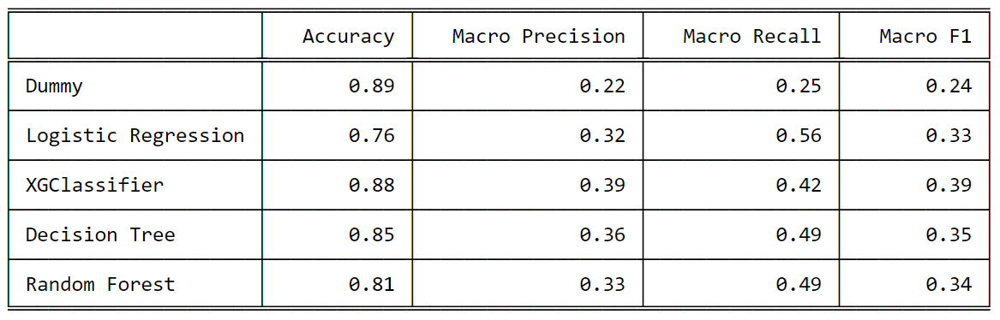
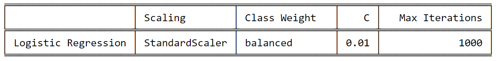
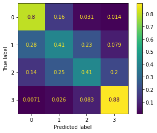

# Chicago Crash Analysis
Group 3 Phase 3: Jesse Markowitz, Angie Rincon, Meaghan Ross

# Overview
 <br />

Our stakeholder will be the City of Chicago Department of Transportation (CDOT). The purpose of this project is to provide the CDOT with valuable insight regarding the factors that most contribute to an increasing severity of crashes (fatalities, serious injury), as well as a predictive model that can be used to make recommendations to the city in order to help reduce injuries and create safer roads and driving conditions.
# Business Understanding

Chicago Department of Transportation would like to find ways to decrease fatal car accidents.

Using the data from Chicago Data Portal, we would like to determine the key features that predict a fatal car crash and make appropriate recommendations.

# Data & Methodology

Data regarding crashes in the City of Chicago was given in three separate files. Our primary dataset contains roughly 1,000,000 rows, each pertaining to a given person involved in a car crash since 2013. While other datasets for the vehicles involved exist, given the time frame of the project these were excluded from the current analysis, but can be incorporated at a later time. Visualizations of the data and brief explanations can be found in the ChicagoCrashes_EDA notebook.

We use two of these datasets:

[Crashes](https://data.cityofchicago.org/Transportation/Traffic-Crashes-Crashes/85ca-t3if) contains details of each crash incident

[People](https://data.cityofchicago.org/Transportation/Traffic-Crashes-People/u6pd-qa9d) contains details of each individual involved in each crash incident.

We created a `TARGET` column based on the injury that each individual person incurred during the crash which divided our target class into 4 categories. This resulted in a highly imbalanced dataset.

<br>

For this business question accuracy is not nearly as informative as the macro recall score at determining model efficacy because we have a severely imbalanced data set. Macro recall emphasizes correct classification of less prevalent classes.


## EDA
We found street lighting, sex, and safety equipment use to be important features in our models. 

### Exploring Street Lighting and Severity of Injury
<br>
We discovered that the severity of injury leading up to fatalities increased at night, but only on roads that were marked as lighted roads. 
In our investigation we also noticed that fatalities were consistently lower across all other times of day and lighting conditions. 
We don’t know why this pattern exists necessarily, but it does lead us to question if there are other contributing factors and the quality of information reported in the crash records as well as the quality of lighting conditions on the roads of Chicago.

### Exploring Sex and Severity of Injury
<br>
Although men and women are involved in crashes at slightly unequal rates, they suffer injuries in accordance with those rates. However, when it comes to fatalities, men are dying at rates far above their presence in the overall crash data.
### Exploring Safety Equipment and Severity of Injury
<br>
Safety equipment includes things like airbags, seatbelts, helmets, and child car seats.
We found the greatest proportion of fatalities were connected to individuals not utilizing safety equipment. 


For more in-depth visualizations: [Chicago Crashes EDA](ChicagoCrashes_EDA.ipynb)
## Models

We were attempting to maximize the macro recall and then moved forward with tuning on models that performed well.  

<br>

# Final Model
<br>

<br>

When finding a model to predict the severity of injuries we saw that logistic regression was performing the best in our metric called macro recall.
In trying to maximize the macro recall, our goal was to reduce the misclassification of severe injuries and fatalities as seen in the number of false negatives.
We were able to increase the performance of our model by balancing the class weight and including more features, expanding from 16 to 34, which improved the macro recall from 31% to 57%. This shows that our final model was better able to predict the less common cases, the fatalities.

# Conclusion


In order to prevent serious injuries and fatalities, Chicago DOT should:

* Increase public awareness of the importance of using safety equipment
* Investigate nighttime crashes despite good lighting
* Investigate sex differences in injury/fatality rate


# Next Steps

Include information about vehicles to explore how car make, model, and year impact severity of injury.
Further explore crashes involving bicycles.
Continue to tune the logistic regression model to maximize its performance.
Update model with new data from Chicago Data Portal.

# For More Information
See the full analysis in the [Jupyter Notebook](ChicagoCrashes_modeling.ipynb) or review [this presentation](Chicago_Crashes_Presentation.pdf).

Jesse Markowitz:  jess.markowitz@gmail.com <br />
Angie Rincon: angiekay.rincon@gmail.com <br />
Meaghan Ross: mer423@nyu.edu <br />

# Project Structure
```
├── README.md
├── Individuals Notebooks       <--- Directory for individual workspaces
│   ├── jesse
│   ├── meaghan
│   ├── angie
│   
├── Chicago-Crashes_Presentation.pdf   
├── ChicagoCrashes_EDA.ipynb     
├── ChicagoCrashes_modeling.ipynb     
└── .gitignore
```
