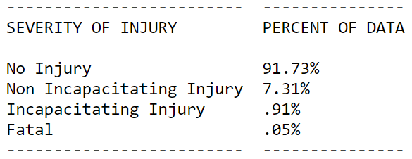
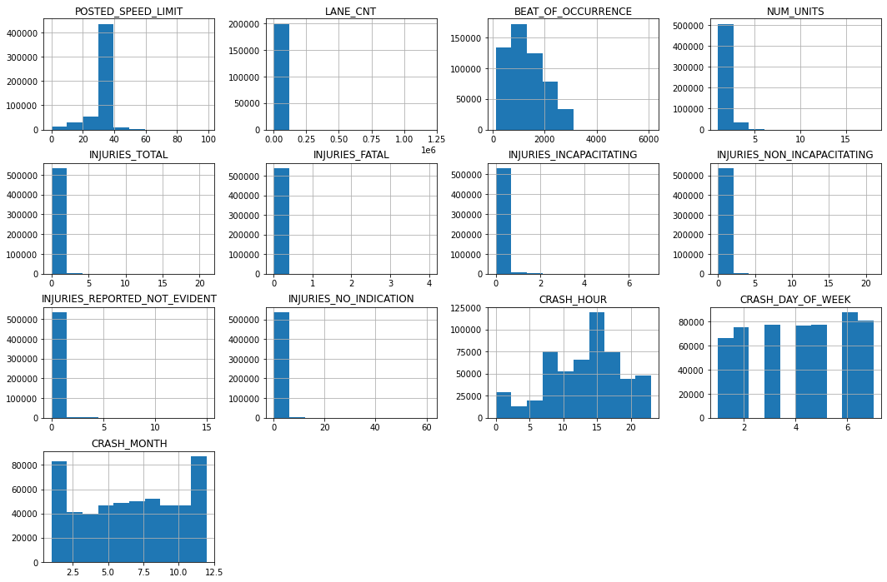
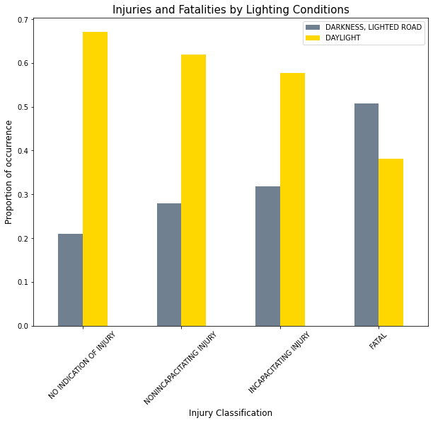
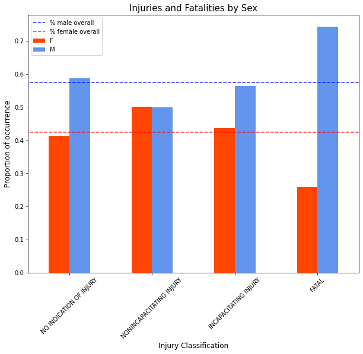
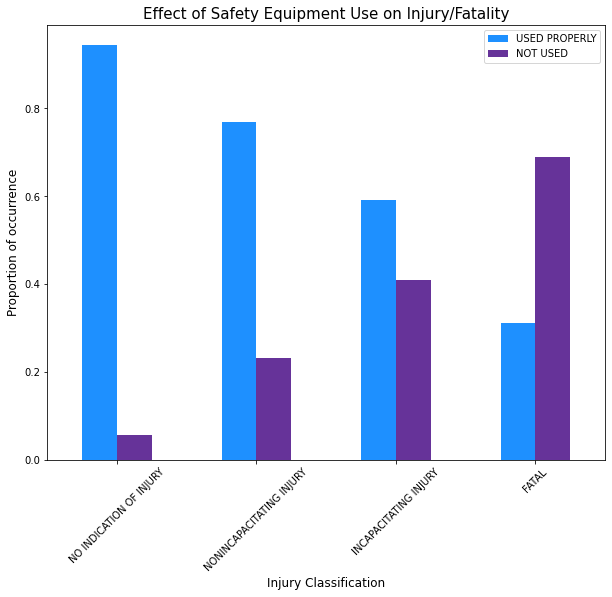

# Chicago Crash Analysis
Group 3 Phase 3: Jesse Markowitz, Angie Rincon, Meaghan Ross

# Overview
 <br />

We analyzed data from Chicago Data Portal in order to make recommendations to the Chicago Department of Transportation for improving safety and decreasing fatal car crashes.

# Business Understanding

Chicago Department of Transportation would like to find ways to decrease fatal car accidents.

Using the data from Chicago Data Portal, we would like to determine the key features that predict a fatal car crash and make appropriate recommendations.

# Data Analysis & Methodology

## Data

The Chicago Data Portal provides datasets containing details of car crashes from 2013-present. 

We use two of these datasets:

[Crashes](https://data.cityofchicago.org/Transportation/Traffic-Crashes-Crashes/85ca-t3if) contains details of each crash incident

[People](https://data.cityofchicago.org/Transportation/Traffic-Crashes-People/u6pd-qa9d) contains details of each individual involved in each crash incident


## Selecting a target for prediction:

We divided out target class into 4 categories. Our classes are highly imbalanced.

<br>

## EDA
<br>
<br>
<br>
<br>

## Models

What do want here? Confusion matrix from best of each type model (logreg, xgclass, decision tree, random forest)? Scores? Add wrap up table after finalizing everything. 

# Results

*Final model here


# Conclusion


In order to prevent serious injuries and fatalities, Chicago DOT should:
Increase public awareness of seatbelt and airbag  importance
Ensure good lighting on roads
Investigate sex differences in injury/fatality rate)


# Next Steps

Include information about vehicles to explore how car make and model impact severity of injury.
Further exploration of crashes involving bicycles

# For More Information
See the full analysis in the [Jupyter Notebook](google.com) or review [this presentation](google.com).

Jesse Markowitz:  jess.markowitz@gmail.com <br />
Angie Rincon: angiekay.rincon@gmail.com <br />
Meaghan Ross: mer423@nyu.edu <br />

# Project Structure
```
├── README.md
├── Individuals Notebooks       <--- Directory for individual workspaces
│   ├── jesse
│   ├── meaghan
│   ├── angie
│   
├── Chicago-Crashes.pdf   <-- non-technical presentation slides
├── final_notebook.ipynb    <-- Jupyter Notebook containing codes detailing project's analysis 
└── .gitignore
```
